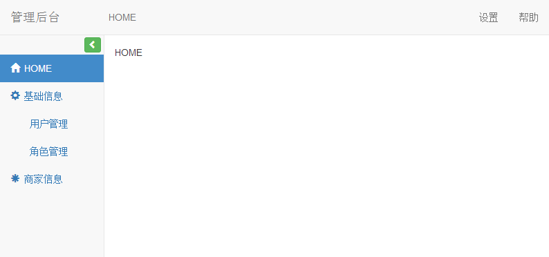

# Bootstrap 管理后台模板

- [admin](admin) bootstrap + jquery，菜单可以收起/隐藏
- [admin-basic](admin-basic) bootstrap + jquery，最简版
- [admin-router](admin-router) bootstrap + jquery + director，加入路由，可以通过异步的方式加载页面
- [admin-angular](admin-angular) bootstrap + angular2

admin、admin-basic、admin-router 使用nginx启动即可

admin-angular 需要NodeJS环境，并安装npm、angular-cli命令。进入项目，执行`npm install`安装依赖，然后执行`ng serve`启动项目，默认启动端口为4200，即可通过`http://localhost:4200`访问

*PS：本文使用的是nodejs-6.9.5、npm-4.1.2、angular-cli-1.0.0-beta.28.3*